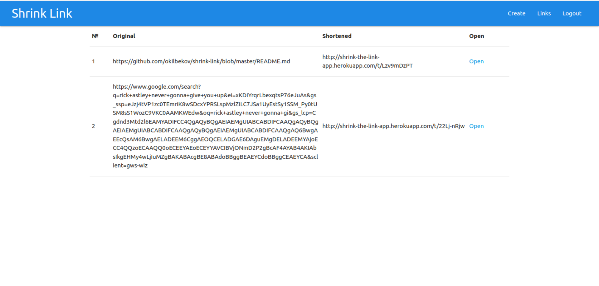

# Shrink Link




## Introduction

Shrink Link allows to reduce long links from Instagram, Facebook, YouTube, Twitter, Linked In and top sites on the Internet, just paste the long URL and click the enter button. On the next screen, copy the shortened URL and share it on websites, chat and e-mail. After shortening the URL, check how many clicks it received.

## Run Locally

Clone the project

```bash
  git clone https://github.com/okilbekov/shrink-link.git
```

Go to the project directory

```bash
  cd shrink-link
```

Install dependencies

```bash
  npm install
  npm run client:install
```

To run in production mode

```bash
  npm run client:build
  npm start
```

To run in development mode

```bash
npm run dev
```